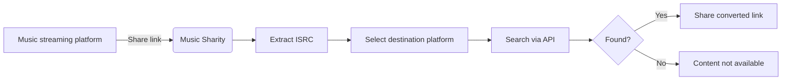

I'm excited to announce the first release of **Music Sharity** – a cross-platform app that converts music links between different streaming services instantly!

<!-- truncate -->

## What is Music Sharity?

[Music Sharity](https://github.com/ByteRoast/music-sharity) is a free and open-source app that lets you share music across different streaming platforms effortlessly. No more copy-pasting song titles or manually searching on different services!

## Why does this exist?

Picture this: You discover an amazing song on Spotify and want to share it with a friend. But they use Apple Music. Your options?

1. ❌ Send them just the title and artist (boring)
2. ❌ Open Apple Music, search manually, copy the link (exhausting)
3. ✅ **Use Music Sharity** – instant conversion! 🎉

## What can you share?

Currently, Music Sharity supports:
- **Tracks** (individual songs)
- **Albums** (including EPs and singles)

:::info
Playlists are not supported as they're platform-specific and don't convert well across services.
:::

## Supported Streaming Platforms

Music Sharity currently works with the **top 5 streaming platforms**:

| Platform | Market Share | Support Level |
|----------|--------------|---------------|
| **Spotify** | 31% | ✅ Direct API |
| **Apple Music** | 15% | ✅ Via Odesli |
| **Deezer** | 2% | ✅ Direct API |
| **YouTube Music** | 8% | ✅ Via Odesli |
| **Tidal** | 1% | ✅ Via Odesli |

For this first version, I focused on the most popular platforms. More platforms could be added in the future, depending on API availability and community interest!

## How can I get Music Sharity?

:::warning Platform Availability
Music Sharity is currently available on **Android** and **Windows** only. iOS, macOS, and Linux builds are functional but not officially maintained due to hardware limitations. Community contributions are welcome!
:::

### Android
- **Google Play Store**: Coming soon...
- **Direct APK**: Download from the [GitHub Releases page](https://github.com/ByteRoast/music-sharity/releases)

### Windows
- Download the latest version from the [GitHub Releases page](https://github.com/ByteRoast/music-sharity/releases)

## How does it work?

Music Sharity uses the **ISRC** (International Standard Recording Code) – a unique identifier attached to every track and album, similar to ISBN for books.

**The conversion process:**

1. Extract the ISRC from the source platform
2. Search for it on the destination platform via API
3. Return the converted link (or inform you if not found)

### Technical Details

- **Direct API integration** for Spotify ↔ Deezer (faster, includes metadata)
- **Odesli API** for Apple Music, YouTube Music, and Tidal (universal compatibility)
- **No data collection** – Everything happens on your device
- **Open source** – Check out the code on [GitHub](https://github.com/ByteRoast/music-sharity)!

## Features

- 🎵 Convert between 5 platforms
- 📀 Support for tracks and albums
- 🔄 Fast conversion with direct API integration
- 📱 Native Android sharing (appears in the share menu!)
- 🎨 Modern Material Design 3 dark theme
- 🔒 Privacy-focused (no tracking, no analytics)
- 🆓 Free and Open Source (GPL v3)

## Why "Music Sharity"?

The name is a blend of:
- **Music** (obvious, I hope! 😄)
- **Share** + **Charity** = **Sharity**

The idea is to *share* music across platforms in the spirit of generosity and openness.

## Screenshots

  
  
  

## What's Next?

Here's what's planned for future releases:

- 🎵 Additional platforms
- 💾 Conversion history
- 🖼️ Album artwork display
- 🌍 Internationalization (French, German)
- 🍎 iOS support (need Mac contributors!)

## Contributing

Music Sharity is **open source** (GPL v3)! Contributions are welcome, especially for:

- 🍎 iOS/macOS support (need Mac owners!)
- 🐧 Linux packaging (AppImage, Snap, Flatpak)
- 🌐 Web optimization
- 🎵 New platform integrations
- 🐛 Bug fixes

Check out the [Contributing Guide](https://github.com/ByteRoast/music-sharity/blob/main/CONTRIBUTING.md) to get started!

---

**Try Music Sharity today and make music sharing effortless!** 🎵

👉 [Download on GitHub](https://github.com/ByteRoast/music-sharity/releases)  
⭐ [Star the project](https://github.com/ByteRoast/music-sharity)  
🐛 [Report issues](https://github.com/ByteRoast/music-sharity/issues)
